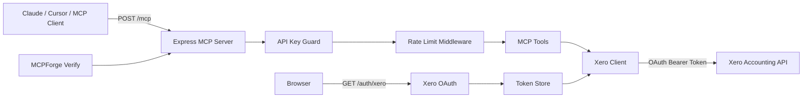

# Xero MCP Server

[](https://github.com/your-org/xero-mcp-server/actions/workflows/ci.yml)
[](https://www.mcpforge.tech/verified/xero-mcp)
[](LICENSE)

A production-ready Model Context Protocol server for the Xero Accounting API.

This template lets Claude Desktop, Cursor, Windsurf, and other MCP-compatible clients read and write accounting data through controlled Xero tools.

> Built as a starter template for teams that want a secure baseline before adding company-specific accounting workflows.

## Who this is for

This repository is useful for:

- developers building AI accounting assistants,
- finance teams experimenting with MCP workflows,
- SaaS teams connecting Xero to internal AI agents,
- platform engineers who need a clean TypeScript MCP server example,
- agencies building custom Xero automations for clients.

## Features

- TypeScript + Express MCP server
- Xero OAuth 2.0 authorization flow
- Refresh-token support
- API key protection for `/mcp`
- Rate limiting for MCP requests
- Health endpoint at `/health`
- Structured Pino logging
- Zod-based environment validation
- MCP tools for invoices, contacts, accounts, and payments
- Jest test setup with Supertest
- GitHub Actions CI workflow

## Architecture



See the larger diagram in [`docs/architecture.md`](docs/architecture.md).

## Available MCP tools

| Tool | Purpose |
|---|---|
| `xero_list_invoices` | List invoices with optional status, contact, and page filters. |
| `xero_create_invoice` | Create a draft or authorised sales invoice / bill. |
| `xero_list_contacts` | Search and list customers or suppliers. |
| `xero_get_account` | Fetch a chart-of-accounts entry by code or UUID. |
| `xero_list_accounts` | List accounts filtered by type and status. |
| `xero_create_payment` | Record a payment against an authorised invoice. |

## Quick start

### 1. Install dependencies

```bash
npm ci
```

### 2. Configure environment

```bash
cp .env.example .env
```

Edit `.env`:

```bash
PORT=3000
NODE_ENV=development
LOG_LEVEL=info
SERVER_BASE_URL=http://localhost:3000

MCP_API_KEY=replace-with-a-long-random-secret

XERO_CLIENT_ID=your-xero-client-id
XERO_CLIENT_SECRET=your-xero-client-secret
XERO_REDIRECT_URI=http://localhost:3000/auth/xero/callback
XERO_SCOPES="openid profile email accounting.transactions accounting.contacts accounting.settings offline_access"

RATE_LIMIT_WINDOW_MS=900000
RATE_LIMIT_MAX=100
```

### 3. Run locally

```bash
npm run dev
```

### 4. Authorize Xero

Open this URL in your browser:

```text
http://localhost:3000/auth/xero
```

After successful authorization, check status:

```bash
curl http://localhost:3000/auth/status
```

### 5. Check health

```bash
curl http://localhost:3000/health
```

## Xero OAuth setup

In the Xero Developer Portal:

1. Create a new app.
2. Add this redirect URI:

```text
http://localhost:3000/auth/xero/callback
```

3. Copy the client ID and client secret into `.env`.
4. Make sure your app has access to the scopes used by this server:

```text
openid profile email accounting.transactions accounting.contacts accounting.settings offline_access
```

For production, set `XERO_REDIRECT_URI` to your deployed callback URL, for example:

```text
https://your-domain.com/auth/xero/callback
```

## Connect to Claude Desktop

Build the server first:

```bash
npm run build
```

Then add an MCP server entry in your Claude Desktop configuration.

Example for a local HTTP MCP endpoint:

```json
{
  "mcpServers": {
    "xero": {
      "url": "http://localhost:3000/mcp",
      "headers": {
        "X-API-Key": "replace-with-your-mcp-api-key"
      }
    }
  }
}
```

Restart Claude Desktop after editing the configuration.

## Connect to Cursor

In Cursor, add a new MCP server using the HTTP endpoint:

```json
{
  "name": "xero",
  "url": "http://localhost:3000/mcp",
  "headers": {
    "X-API-Key": "replace-with-your-mcp-api-key"
  }
}
```

Then restart Cursor or reload the MCP server list.

## Security notes

This template is intentionally safer than a minimal demo, but you should still harden it before production use.

Recommended production changes:

- Replace the in-memory token store in `src/auth.ts` with Redis, Postgres, or another encrypted durable store.
- Store secrets in a managed secret manager, not in plain `.env` files.
- Rotate `MCP_API_KEY` regularly.
- Add per-user or per-tenant authorization if multiple users will access the server.
- Restrict write tools such as `xero_create_invoice` and `xero_create_payment` behind approvals.
- Add audit logs for every tool call.
- Use HTTPS in production.
- Review scopes and remove anything your use case does not need.

## Security Review

You can verify this MCP server with MCPForge:

```text
https://www.mcpforge.tech/verify
```

MCPForge can help review:

- exposed tools,
- authentication behavior,
- health checks,
- compatibility with MCP clients,
- risk level of write operations,
- security posture before publishing or deployment.

After verification, you can link your public report from this README:

```markdown
[](https://www.mcpforge.tech/verified/xero-mcp)
```

Full MCPForge guide:

```text
https://www.mcpforge.tech/blog/xero-mcp-server
```

## Deployment

A common production setup:

1. Deploy this service to Railway, Render, Fly.io, AWS, GCP, Azure, or a private Kubernetes cluster.
2. Configure environment variables in the hosting provider.
3. Set `SERVER_BASE_URL` to your public HTTPS URL.
4. Set `XERO_REDIRECT_URI` to `https://your-domain.com/auth/xero/callback`.
5. Add the same callback URL in the Xero Developer Portal.
6. Run the OAuth flow once to connect the Xero tenant.
7. Verify `/health` and `/mcp` before connecting production AI clients.
8. Run a public or private verification with MCPForge.

## Local development commands

```bash
npm run lint
npm run typecheck
npm test
npm run build
```

## API endpoints

| Method | Path | Description |
|---|---|---|
| `GET` | `/health` | Health and Xero connectivity check. |
| `GET` | `/auth/xero` | Start Xero OAuth authorization. |
| `GET` | `/auth/xero/callback` | Xero OAuth callback. |
| `GET` | `/auth/status` | Current authorization status. |
| `POST` | `/mcp` | MCP endpoint protected by `X-API-Key`. |

## Repository checklist

Before publishing your fork:

- [ ] Replace `your-org` in the CI badge URL.
- [ ] Replace the MCPForge badge slug if your public slug is not `xero-mcp`.
- [ ] Replace the blog link with your final MCPForge article URL.
- [ ] Add screenshots or a real verification report once available.
- [ ] Configure production token storage.
- [ ] Review Xero scopes.

## License

MIT — see [`LICENSE`](LICENSE).
