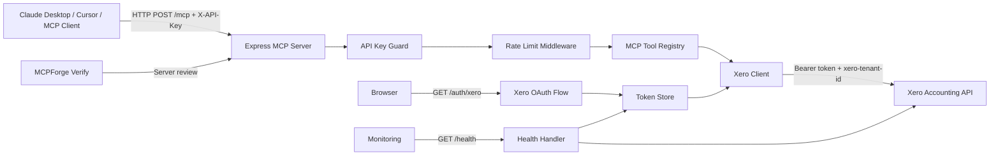

# Xero MCP Server Architecture

## Main components

- `src/server.ts` — Express app, MCP server, tool registration, `/mcp` route.
- `src/auth.ts` — Xero OAuth flow, token refresh, API key middleware.
- `src/config.ts` — environment validation with Zod.
- `src/health.ts` — health endpoint and Xero connectivity check.
- `src/xeroClient.ts` — typed Xero API wrapper used by MCP tools.
- `src/__tests__` — Jest tests for config, health, auth guard, and rate limiting.
